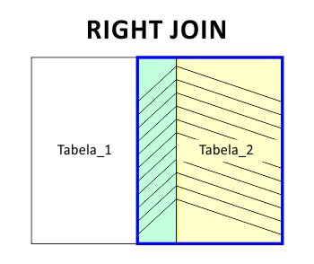

# SQL_JOIN
Material de estudo - Case para teste seletivo

# JOIN - Relacionamento de Tabelas

## O que vamos aprender?

  * Olá, hoje você vai aprender a utilizar a *cláusula* **`JOIN`**;
    - Com o **`JOIN`** voce pode combinar dados entre tabelas relacionadas ou até mesmo entre dados de uma única tabela de um determinado banco de dados, afim de gerar uma nova tabela personalizada conforme a sua necessidade;


## Você será capaz de:

  * Compreender como utilizar **`INNER JOIN`**, para combinar dados entre duas ou mais tabelas;
  * Voce também vai aprender os casos de **`LEFT JOIN`** e **`RIGHT JOIN`**, para combinar dados entre duas ou mais tabelas, preservando dados de uma das tabelas mesmo tendo uma referencia não atendida;
  
  * Nao deixe de ver os recurso adicionais, voce vai aprender um pouco mais sobre exemplos de **`SELF JOIN`**, **`FULL JOIN`**, **`SEMI JOIN`** e **`ANTI JOIN`** e algumas curiosidades a mais;


## Porque isso é importante?

  A *cláusula* **`JOIN`** permite que os dados de duas ou mais tabelas ou entre dados de uma mesma tabela sejam combinados com base na relação existente ou um valor referenciado. Com esse conhecimento você consegue atender a necessidades especificas do seu cliente e otimizar tarefas importantes do seu dia a dia;


## Conteúdos

  Para melhor fixar este conteúdo, recomendamos que voce acompanhe e execute na pratica os exemplos que vamos mostrar;

  Criamos um banco de dados fictício de uma escola com apenas 3 tabelas para você exercitar e melhor absorver este conteúdo;


  Observe o diagrama do nosso banco de dados:

  

  
  ***Execute o SQLScript abaixo no seu MYSQL Workbench ou no software de sua preferência:***

  ```
  -- MySchool Sample Database Schema

  DROP DATABASE IF EXISTS `MySchool`;
  CREATE DATABASE IF NOT EXISTS `MySchool`;
  USE `MySchool`;

  -- -----------------------------------------------------
  -- Table `MySchool`.`Students`
  -- -----------------------------------------------------
  CREATE TABLE IF NOT EXISTS `MySchool`.`Students` (
    `id` INT(1) NOT NULL AUTO_INCREMENT,
    `first_name` VARCHAR(20),
    `last_name` VARCHAR(20),
    `age` INT(1),
    PRIMARY KEY (`id`),
    INDEX `first_name` (`first_name` ASC)
  ) Engine = InnoDB;

  -- -----------------------------------------------------
  -- Table `MySchool`.`Grades`
  -- -----------------------------------------------------
  CREATE TABLE IF NOT EXISTS `MySchool`.`Grades` (
    `id` INT(1) NOT NULL AUTO_INCREMENT,
    `grade` INT(1),
    `student_id` INT(1) NULL DEFAULT NULL,
    PRIMARY KEY (`id`),
    INDEX `grade` (`grade` ASC),
      FOREIGN KEY (`student_id`)
      REFERENCES `MySchool`.`Students` (`id`)
      ON DELETE CASCADE
  ) Engine = InnoDB;

  -- -----------------------------------------------------
  -- Table `MySchool`.`Exams`
  -- -----------------------------------------------------
  CREATE TABLE IF NOT EXISTS `MySchool`.`Exams` (
    `id` INT(1) NOT NULL AUTO_INCREMENT,
    `student_id` INT(1) NULL DEFAULT NULL,
    `score` INT(1) NULL DEFAULT NULL,
    `status` VARCHAR(20) DEFAULT NULL,
    `exam_status` BOOLEAN,
    PRIMARY KEY (`id`),
    INDEX `score` (`score` DESC),
      FOREIGN KEY (`student_id`)
      REFERENCES `MySchool`.`Students` (`id`)
      ON DELETE CASCADE
  ) Engine = InnoDB;


  -- Tables created, starting Dumping now;

  #
  # Dumping data for table 'Students'
  #
  INSERT INTO `MySchool`.`Students` (`first_name`, `last_name`, `age`)
  VALUES
    ('Jorge', 'Nends', 37),
    ('Ana', 'Flor', 23),
    ('Joana', 'Bela', 33),
    ('Andre', 'Molina', 23),
    ('Betina', 'Mendes', 35),
    ('Carlos', 'Berer', 31),
    ('Betina', 'Mendes', 35),
    ('Gregor', 'Hands', 23);

  #
  # Dumping data for table 'Grades'
  #
  INSERT INTO `MySchool`.`Grades` (`grade`, `student_id`)
  VALUES
    (5, 1),
    (5, 2),
    (5, 7),
    (5, 8),
    (6, 3),
    (6, 4),
    (6, 5),
    (6, 6);

  #
  # Dumping data for table 'Exams'
  #
  INSERT INTO `MySchool`.`Exams` (`student_id`, `score`, `status`, `exam_status`)
  VALUES
    (1, 88, 'Approved', true),
    (2, 78, 'Not approved yet', true),
    (3, 98, 'Approved', true),
    (4, 68, 'Not approved yet', true),
    (5, 35, 'Not approved yet', true),
    (6, NULL, NULL, false),
    (7, NULL, NULL, false),
    (8, NULL, NULL, false);
    
  ```


  ### Recurso adicional - SQL ALIAS (AS) no MySQL

  Para tornar mais fácil ou intuitivo de entender os dados retornados ao realizar uma junção, você pode utilizar a cláusula **`AS`**, ou seja, um apelido, para renomear uma coluna ou tabela. Veja no exemplo abaixo como utilizar este recurso e analise o resultado:

  **Sem ALIAS:**

  ```
  SELECT CONCAT(Students.first_name, ' ', Students.last_name) 
  FROM MySchool.Students
  INNER JOIN MySchool.Exams
  ON MySchool.Students.id = MySchool.Exams.student_id
  WHERE MySchool.Students.age > 30;
  ```

  **Resultado:**

  CONCAT(Students.first_name, ' ', Students.last_name)
  :---
  Jorge Nends
  Joana Bela
  Betina Mendes
  Carlos Berer
  Betina Mendes


  **Com ALIAS:**

  ```
  SELECT CONCAT(S.first_name, ' ', S.last_name) AS 'FullName'
  FROM MySchool.Students AS S
  INNER JOIN MySchool.Exams AS E
  ON S.id = E.student_id
  WHERE S.age > 30;
  ```

  **Resultado:**

  FullName
  :---
  Jorge Nends
  Joana Bela
  Betina Mendes
  Carlos Berer
  Betina Mendes


  * Repare que além de facilitar o entendimento do código podemos personalizar o nome da Coluna. Então quando você precisar criar queries mais complexas, ja sabe como facilitar e ou customizar seu código. Legal né!;
  
  * Agora vamos entender o resultado de um simples INNER JOIN;


 ### INNER JOIN

 


Execute a query abaixo:

  ```
  SELECT * 
  FROM MySchool.Students as S
  INNER JOIN MySchool.Exams as E
  ON S.id = E.student_id;
  ```


  Seu resultado deve retornar assim:
  
  id  | first_name | last_name | age  | id  | student_id | score  | status            | exam_status
  :---|	:---       |	:---     |:---  |	:---|	:---       |	:---  |	:---            	| :---
  1   |	Jorge      |	Nends    |	37  |	1   |	1          |	88    |	Approved	        | 1
  2   |	Ana        |	Flor     |	23  |	2   |	2          |	78    |	Not approved yet	| 1
  3   |	Joana      |	Bela     |	33  |	3   |	3          |	98    |	Approved	        | 1
  4   |	Andre      |	Molina   |	23  |	4   |	4          |	68    |	Not approved yet	| 1
  5   |	Betina     |	Mendes   |	35  |	5   |	5          |	35    |	Not approved yet	| 1
  6   |	Carlos     |	Berer    |	31  |	6   |	6          |	NULL  | NULL              | 0
  7   |	Betina     |	Mendes   |	35  |	7   |	7          |	NULL  | NULL              | 0
  8   |	Gregor     |	Hands    |	23  |	8   |	8          |	NULL  | NULL              | 0


Agora digamos que voce precise de uma tabela que retorne o **`Nome Completo`** dos alunos que ja realizaram as **`provas`** e de qual **`turma`** eles são, repare que vamos renomear os nomes das colunas para a tabela ficar mais amigável;


Execute a query abaixo e analise o resultado, repare que agora estamos relacionando dados de 3 tabelas diferentes:

  ```
  SELECT CONCAT(S.first_name, ' ', S.last_name) AS 'Nome Completo', E.score AS 'Nota Final', G.grade AS 'Turma'
  FROM MySchool.Students as S
  INNER JOIN MySchool.Exams as E
  ON S.id = E.student_id
  INNER JOIN MySchool.Grades as G
  ON S.id = G.student_id
  AND E.exam_status = true;
  ```

  Seu resultado deve retornar assim:

  Nome Completo | Nota Final | Turma
  :---          | :---       | :---
  Jorge Nends   |	88         | 5
  Ana Flor      |	78         | 5
  Joana Bela    |	98         | 6
  Andre Molina  |	68         | 6
  Betina Mendes |	35         | 6


Agora você já conheceu o poder do **`JOIN`**, então vamos nos aprofundar ainda mais nesse conteúdo;


### LEFT JOIN


Execute a query abaixo:

  ```
  SELECT *
  FROM MySchool.Students as S
  LEFT JOIN MySchool.Grades as G
  ON S.id = G.student_id
  AND G.grade = 5;
  ```


* Repare que dessa vez os dados da tabela da **`Esquerda`** foi preservado mesmo nao sendo verdadeira a referencia da **`turma 5`** que escrevemos no código, as referencias nao atendidas retornam com os valores **`Nulos`**;

Seu resultado deve retornar assim:

  id  | first_name | last_name | age  | id   | grade | student_id
 :--- | :---       | :---      | :--- | :--- | :---  | :---      
  1	  | Jorge      |	Nends    |	37  |	1    |	5	   | 1
  2	  | Ana        |	Flor     |	23  |	2    |	5	   | 2
  3	  | Joana      |	Bela     |	33  |	NULL | NULL  | NULL
  4	  | Andre      |	Molina   |	23  |	NULL | NULL  | NULL
  5	  | Betina     |	Mendes   |	35  |	NULL | NULL  | NULL
  6	  | Carlos     |	Berer    |	31  |	NULL | NULL  | NULL
  7	  | Betina     |	Mendes   |	35  |	3    |	5	   | 7
  8	  | Gregor     |	Hands    |	23  |	4    |	5	   | 8


### RIGHT JOIN




Execute a query abaixo:

  ```
  SELECT *
  FROM MySchool.Students as S
  RIGHT JOIN MySchool.Grades as G
  ON S.id = G.student_id
  AND G.grade = 5;
  ```


* Repare que simplesmente substituímos o **`LEFT JOIN`** pelo **`RIGHT JOIN`**, dessa vez os dados da tabela da **`Direita`** foi preservado e os dados das referencias nao atendidas também retornaram, mas dessa vez com valores **`Nulos`**;

Seu resultado deve retornar assim:

  id   | first_name | last_name | age  | id   | grade | student_id
 :---  | :---       | :---      | :--- | :--- | :---  | :---      
  1    | Jorge      |	Nends     |	37   |	1   |	5     |	1
  2    | Ana        |	Flor      |	23   |	2   |	5     |	2
  7    | Betina     |	Mendes    |	35   |	3   |	5     |	7
  8    | Gregor     |	Hands     |	23   |	4   |	5     |	8
  NULL | NULL       | NULL      | NULL |  5   |	6     |	3
  NULL | NULL       | NULL      | NULL |	6   |	6     |	4
  NULL | NULL       | NULL      | NULL |	7   |	6     |	5
  NULL | NULL       | NULL      | NULL |	8   |	6     |	6


## Exercícios de fixação


### Utilizando o INNER JOIN:


1 - Construa uma query que retorne todas as colunas da tabela *`Students`* e uma coluna com o **`status`** de aprovação com o alias **`Aprovado`**  da tabela**`Exams`**, dos alunos que tenham mais de 30 anos;

* DICA: Para selecionar as colunas conforme o requisito, voce deve escrever algo assim: **`SELECT MySchool.Students.*, MySchool.Exams.exam_status as 'Aprovado' FROM ...`**

* Repare na sintaxe da dica, em como selecionamos as colunas da tabela Students.


2 - Construa uma query que retorne uma coluna da tabela *`Students`* com o Nome Completo do aluno com o alias **`Nome Completo`**, uma coluna da tabela **`Exams`** com o *`status`* de aprovação do aluno com o alias **`Aprovado`**, somente dos alunos que ja realizaram a prova (*`exam_status`*) e uma coluna da tabela *`Grades`* com o alias **`Turma`** da turma que ele pertence;

* DICA: Reveja o conteúdo onde trouxemos um exemplo de como 'CONCATENAR' colunas ao escrever sua query!


### Utilizando o LEFT JOIN:


1 - Construa uma query que retorne todas as colunas da tabela Students e uma coluna da tabela *`Exams`* dos alunos que ja realizaram as provas com o alias **`Prova Entregue`**;

* DICA (opcional): A coluna **`exam_status`** tem seus valores **`booleanos`** por padrão, quando verdadeiro retorna **'1'** e quando falso retorna **'0'**. Com o operador **`IF()`**, isso mesmo, também temos o IF no SQL, assim podemos personalizar também os valores. Então ao indicar sua coluna no SELECT da query, voce pode escrever algo assim: **`IF(MySchool.Exams.exam_status = 1, 'Sim', 'Não')`**. Legal ne! - Mas lembra também que quando falamos sobre **LEFT JOIN** em quando nao ha dados relacionados ele preserva os valores da tabela da **Esquerda** e trás os valores nulos? Então, pratique essa query com o **IF()** que recomendamos e **sem** ele para ver a diferença.


2 - Construa uma query que retorne uma coluna da tabela *`Student`* com o alias **`Nome Completo`** com o nome aluno e todas as colunas da tabela *`Exams`*, relacionando apenas quem ja fez a **Prova**;

* DICA: Reveja o conteúdo onde trouxemos um exemplo de como 'CONCATENAR' colunas ao escrever sua query!

### Utilizando o RIGHT JOIN:

  Para o RIGHT JOIN vamos apenas substituir o LEFT JOIN por RIGHT JOIN dos mesmos exercícios que fizemos acima. O importante e perceber e abstrair com bastante atenção. Bora ver?!

  ----------------------------------------------------------------

  * Muito bem, neste momento voce ja esta craque no assunto e pronto para exercitar todos esse conhecimento. Se você teve dificuldades para construir esses exercícios de fixação, de uma olhada no Gabarito que deixamos pra voce, vai ajudar a ficar ainda mais a vontade com o conteúdo.

  * Pronto para exercitar seu aprendizado?! #vqv :rocket:

## Vamos praticar!


  Para os nossos exercícios iremos utilizar um banco de dados que apelidamos de SpotifyClone, um exemplo de banco de dados de um aplicativo de musicas.


  Observe o diagrama do nosso banco de dados:

  


  ***Execute o SQLScript abaixo no seu MYSQL Workbench ou no software de sua preferência:***

  ```
  -- SpotifyClone Sample Database Schema

    DROP DATABASE IF EXISTS `SpotifyClone`;
    CREATE DATABASE IF NOT EXISTS `SpotifyClone`;
    USE `SpotifyClone`;

    -- -----------------------------------------------------
    -- Table `SpotifyClone`.`plans`
    -- -----------------------------------------------------
    CREATE TABLE IF NOT EXISTS `SpotifyClone`.`plans` (
      `id` INT(11) NOT NULL AUTO_INCREMENT,
      `plan` VARCHAR(20),
      `price` DECIMAL(19,2),
      PRIMARY KEY (`id`),
      INDEX `plan` (`plan` ASC)
    ) Engine = InnoDB;

    -- -----------------------------------------------------
    -- Table `SpotifyClone`.`users`
    -- -----------------------------------------------------
    CREATE TABLE IF NOT EXISTS `SpotifyClone`.`users` (
      `id` INT(11) NOT NULL AUTO_INCREMENT,
      `plan_id` INT(11) NULL DEFAULT NULL,
      `user_name` VARCHAR(50),
      `age` INT(11),
      PRIMARY KEY (`id`),
      INDEX `user_name` (`user_name` ASC),
        FOREIGN KEY (`plan_id`)
        REFERENCES `SpotifyClone`.`plans` (`id`)
        ON DELETE NO ACTION
        ON UPDATE NO ACTION
    ) Engine = InnoDB;

    -- -----------------------------------------------------
    -- Table `SpotifyClone`.`artists`
    -- -----------------------------------------------------
    CREATE TABLE IF NOT EXISTS `SpotifyClone`.`artists` (
      `id` INT(11) NOT NULL AUTO_INCREMENT,
      `artist_name` VARCHAR(20),
      PRIMARY KEY (`id`),
      INDEX `artist_name` (`artist_name` ASC)
    ) Engine = InnoDB;

    -- -----------------------------------------------------
    -- Table `SpotifyClone`.`albums`
    -- -----------------------------------------------------
    CREATE TABLE IF NOT EXISTS `SpotifyClone`.`albums` (
      `id` INT(11) NOT NULL AUTO_INCREMENT,
      `album_name` VARCHAR(20),
      `artist_id` INT(11),
      `released` YEAR(4),
      PRIMARY KEY (`id`),
      INDEX `album_name` (`album_name` ASC),
        FOREIGN KEY (`artist_id`)
        REFERENCES `SpotifyClone`.`artists` (`id`)
        ON DELETE NO ACTION
        ON UPDATE NO ACTION
    ) Engine = InnoDB;

    -- -----------------------------------------------------
    -- Table `SpotifyClone`.`tracks`
    -- -----------------------------------------------------
    CREATE TABLE IF NOT EXISTS `SpotifyClone`.`tracks` (
      `id` INT(11) NOT NULL AUTO_INCREMENT,
      `track` VARCHAR(50),
      `album_id` INT NOT NULL,
      `duration` TIME,
      PRIMARY KEY (`id`),
        FOREIGN KEY (`album_id`)
        REFERENCES `SpotifyClone`.`albums` (`id`)
        ON DELETE NO ACTION
        ON UPDATE NO ACTION
      ) Engine = InnoDB;

    -- -----------------------------------------------------
    -- Table `SpotifyClone`.`followed_artist`
    -- -----------------------------------------------------
    CREATE TABLE IF NOT EXISTS `SpotifyClone`.`followed_artist` (
      `id` INT(11) NOT NULL AUTO_INCREMENT,
      `user_id` INT(11),
      `artist_id` INT(11),
      PRIMARY KEY (`id`, `user_id`, `artist_id`),
        FOREIGN KEY (`user_id`)
        REFERENCES `SpotifyClone`.`users` (`id`)
        ON DELETE NO ACTION
        ON UPDATE NO ACTION,
        FOREIGN KEY (`artist_id`)
        REFERENCES `SpotifyClone`.`artists` (`id`)
        ON DELETE NO ACTION
        ON UPDATE NO ACTION
    ) Engine = InnoDB;

    -- -----------------------------------------------------
    -- Table `SpotifyClone`.`play_history`
    -- -----------------------------------------------------
    CREATE TABLE IF NOT EXISTS `SpotifyClone`.`play_history` (
      `id` INT(11) NOT NULL AUTO_INCREMENT,
      `user_id` INT(11),
      `track_id` INT(11),
      `date` DATETIME NULL DEFAULT NULL,
      PRIMARY KEY (`id`, `user_id`, `track_id`),
      INDEX `date` (`date` DESC),
        FOREIGN KEY (`user_id`)
        REFERENCES `SpotifyClone`.`users` (`id`)
        ON DELETE NO ACTION
        ON UPDATE NO ACTION,
        FOREIGN KEY (`track_id`)
        REFERENCES `SpotifyClone`.`tracks` (`id`)
        ON DELETE NO ACTION
        ON UPDATE NO ACTION
    ) Engine = InnoDB;


    -- Tables created, starting Dumping now;

    #
    # Dumping data for table 'plans'
    #
    INSERT INTO `SpotifyClone`.`plans` (`plan`, `price`)
    VALUES
      ('gratuito', 0),
      ('familiar', 7.99),
      ('universitário', 5.99),
      ('pessoal', 6.99);

    #
    # Dumping data for table 'users'
    #
    INSERT INTO `SpotifyClone`.`users` (`plan_id`, `user_name`, `age`)
    VALUES
      (1, 'Thati', 23),
      (2, 'Cintia', 35),
      (3, 'Bill', 20),
      (4, 'Roger', 45),
      (4, 'Norman', 58),
      (2, 'Patrick', 33),
      (3, 'Vivian', 26),
      (3, 'Carol', 19),
      (2, 'Angelina', 42),
      (2, 'Paul', 46);

    #
    # Dumping data for table 'artists'
    #
    INSERT INTO `SpotifyClone`.`artists` (`artist_name`)
    VALUES
      ('Fog'),
      ('Freedie Shannon'),
      ('Lance Day'),
      ('Tyler Isle'),
      ('Peter Strong'),
      ('Walter Phoenix');

    #
    # Dumping data for table 'artists'
    #
    INSERT INTO `SpotifyClone`.`albums` (`album_name`, `artist_id`, `released`)
    VALUES
      ('Envious', 6, '1990'),
      ('Exuberant', 6, '1993'),
      ('Hallowed Steam', 5, '1995'),
      ('Incandescent', 3, '1998'),
      ('Temporary Culture', 2, '2001'),
      ('Library of liberty', 2, '2003'),
      ('Chained Down', 4, '2007'),
      ('Cabinet of fools', 4, '2012'),
      ('No guarantees', 4, '2015'),
      ('Apparatus', 1, '2015');

    #
    # Dumping data for table 'tracks'
    #
    INSERT INTO `SpotifyClone`.`tracks` (`track`, `album_id`, `duration`)
    VALUES
      ('Soul For Us', 1, SEC_TO_TIME(200)),
      ('Reflections Of Magic', 1, SEC_TO_TIME(163)),
      ('Dance With Her Own', 1, SEC_TO_TIME(116)),
      ('Troubles Of My Inner Fire', 2, SEC_TO_TIME(203)),
      ('Time Fireworks', 2, SEC_TO_TIME(152)),
      ('Magic Circus', 3, SEC_TO_TIME(105)),
      ('Honey, So Do I', 3, SEC_TO_TIME(207)),
      ("Sweetie, Let's Go Wild", 3, SEC_TO_TIME(139)),
      ("She Knows", 3, SEC_TO_TIME(244)),
      ("Fantasy For Me", 4, SEC_TO_TIME(100)),
      ("Celebration Of More", 4, SEC_TO_TIME(146)),
      ("Rock His Everything", 4, SEC_TO_TIME(223)),
      ("Home Forever", 4, SEC_TO_TIME(231)),
      ("Diamond Power", 4, SEC_TO_TIME(241)),
      ("Let's Be Silly", 4, SEC_TO_TIME(132)),
      ("Thang Of Thunder", 5, SEC_TO_TIME(240)),
      ("Words Of Her Life", 5, SEC_TO_TIME(185)),
      ("Without My Streets", 5, SEC_TO_TIME(176)),
      ("Need Of The Evening", 6, SEC_TO_TIME(190)),
      ("History Of My Roses", 6, SEC_TO_TIME(222)),
      ("Without My Love", 6, SEC_TO_TIME(111)),
      ("Walking And Game", 6, SEC_TO_TIME(123)),
      ("Young And Father", 6, SEC_TO_TIME(197)),
      ("Finding My Traditions", 7, SEC_TO_TIME(179)),
      ("Walking And Man", 7, SEC_TO_TIME(229)),
      ("Hard And Time", 7, SEC_TO_TIME(135)),
      ("Honey, I'm A Lone Wolf", 7, SEC_TO_TIME(150)),
      ("She Thinks I Won't Stay Tonight", 8, SEC_TO_TIME(166)),
      ("He Heard You're Bad For Me", 8, SEC_TO_TIME(154)),
      ("He Hopes We Can't Stay", 8, SEC_TO_TIME(210)),
      ("I Know I Know", 8, SEC_TO_TIME(117)),
      ("He's Walking Away", 9, SEC_TO_TIME(159)),
      ("He's Trouble", 9, SEC_TO_TIME(138)),
      ("I Heard I Want To Bo Alone", 9, SEC_TO_TIME(120)),
      ("I Ride Alone", 9, SEC_TO_TIME(151)),
      ("Honey", 10, SEC_TO_TIME(79)),
      ("You Cheated On Me", 10, SEC_TO_TIME(95)),
      ("Wouldn't It Be Nice", 10, SEC_TO_TIME(213)),
      ("Baby", 10, SEC_TO_TIME(136)),
      ("You Make Me Feel So..", 10, SEC_TO_TIME(83));

    #
    # Dumping data for table 'play_history'
    #
    INSERT INTO `SpotifyClone`.`play_history` (`user_id`, `track_id`, `date`)
    VALUES
      (1, 36, '2020-02-28 10:45:55'),
      (1, 25, '2020-05-02 05:30:35'),
      (1, 23, '2020-03-06 11:22:33'),
      (1, 14, '2020-08-05 08:05:17'),
      (1, 15, '2020-09-14 16:32:22'),
      (2, 34, '2020-01-02 07:40:33'),
      (2, 24, '2020-05-16 06:16:22'),
      (2, 21, '2020-10-09 12:27:48'),
      (2, 39, '2020-09-21 13:14:46'),
      (3, 6, '2020-11-13 16:55:13'),
      (3, 3, '2020-12-05 18:38:30'),
      (3, 26, '2020-07-30 10:00:00'),
      (4, 2, '2021-08-15 17:10:10'),
      (4, 35, '2021-07-10 15:20:30'),
      (4, 27, '2021-01-09 01:44:33'),
      (5, 7, '2020-07-03 19:33:28'),
      (5, 12, '2017-02-24 21:14:22'),
      (5, 14, '2020-08-06 15:23:43'),
      (5, 1, '2020-11-10 13:52:27'),
      (6, 38, '2019-02-07 20:33:48'),
      (6, 29, '2017-01-24 00:31:17'),
      (6, 30, '2017-10-12 12:35:20'),
      (6, 22, '2018-05-29 14:56:41'),
      (7, 5, '2018-05-09 22:30:49'),
      (7, 4, '2020-07-27 12:52:58'),
      (7, 11, '2018-01-16 18:40:43'),
      (8, 39, '2018-03-21 16:56:40'),
      (8, 40, '2020-10-18 13:38:05'),
      (8, 32, '2019-05-25 08:14:03'),
      (8, 33, '2021-08-15 21:37:09'),
      (9, 16, '2021-05-24 17:23:45'),
      (9, 17, '2018-12-07 22:48:52'),
      (9, 8, '2021-03-14 06:14:26'),
      (9, 9, '2020-04-01 03:36:00'),
      (10, 20, '2017-02-06 08:21:34'),
      (10, 21, '2017-12-04 05:33:43'),
      (10, 12, '2017-07-27 05:24:49'),
      (10, 13, '2017-12-25 01:03:57');

    #
    # Dumping data for table 'followed_artist'
    #
    INSERT INTO `SpotifyClone`.`followed_artist` (`user_id`, `artist_id`)
    VALUES
      (1, 6),
      (1, 2),
      (1, 3),
      (2, 6),
      (2, 3),
      (3, 5),
      (3, 6),
      (4, 2),
      (5, 4),
      (5, 1),
      (6, 1),
      (6, 3),
      (6, 6),
      (7, 5),
      (7, 4),
      (8, 6),
      (8, 4),
      (9, 1),
      (9, 2),
      (9, 3),
      (10, 5),
      (10, 1);

  ```


### Exercícios

  1º - Elabore uma query que retorne todas as colunas da tabela **`artists`** e todas as colunas da tabela **`albums`** relacionadas ao id do Artista;

  2º - Elabore uma query que retorne uma coluna do nome do artista com o alias **`Artista`** da tabela **`artists`**, uma coluna do nome do album com o alias **`Album`** da tabela **`albums`** e uma coluna do nome da musica com o alias **`Musica`** da tabela **`tracks`**, com base nos dados relacionados;


## Recursos Adicionais


  Abaixo separamos algumas referencias para voce se aprofundar ainda mais e conhecer todos os recursos possíveis que o JOIN pode oferecer e também separamos o link da documentação do MySql e do Mysql Workbench para deixar voce muito bem informado;


 * SQL JOIN(INNER, LEFT, RIGHT e FULL) combinando tabelas!
   - _https://blog.betrybe.com/sql/sql-join/_


 * Diferença entre INNER JOIN e OUTER JOIN | Tipos de JOINS em SQL | SQL para Análise de Dados EP.8
   - _https://www.youtube.com/watch?v=3IdKyi-KezU_


 * SQL JOIN: Entenda como funciona o retorno dos dados
   - _https://www.devmedia.com.br/sql-join-entenda-como-funciona-o-retorno-dos-dados/31006_


 * Bancos Relacionais! Conheça os JOINs do SQL... INNER, OUTER, FULL, SEMI e ANTI JOIN!
   - _https://www.youtube.com/watch?v=165r4qUvp8Q_


 * Getting Started with MySQL
   - _https://dev.mysql.com/doc/mysql-getting-started/en/_


 * MySQL Workbench
   - _https://dev.mysql.com/doc/workbench/en/_
