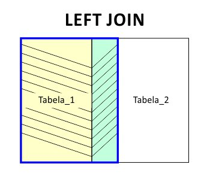

# SQL_JOIN
Material de estudo - Case para teste seletivo

# JOIN - Relacionamento de Tabelas

## O que vamos aprender?

  * Olá, hoje você vai aprender a utilizar a *cláusula* **JOIN**
    - Com o **JOIN** voce pode combinar dados entre tabelas relacionadas ou até mesmo entre dados de uma única tabela de um determinado banco de dados, afim de gerar uma nova tabela personalizada conforme a sua necessidade.


## Você será capaz de:

  * Compreender como utilizar **INNER JOIN**, para combinar dados entre duas ou mais tabelas;
  * Voce também vai aprender os casos de **LEFT JOIN** e **RIGHT JOIN**, também conhecidos como **OUTER JOIN**.
  E alguns exemplos de **SELF JOIN**, **FULL JOIN**, **SEMI JOIN** e **ANTI JOIN**. 


## Porque isso é importante?

  A *cláusula* **JOIN** permite que os dados de duas ou mais tabelas ou entre dados de uma mesma tabela sejam combinados com base na relação existente ou um valor referenciado. Com esse conhecimento você consegue atender a necessidades especificas do seu cliente e otimizar tarefas importantes do seu dia a dia.


## Conteúdos

  Para melhor fixar este conteúdo, recomendamos que voce acompanhe e execute na pratica os exemplos que vamos mostrar.

  Criamos um banco de dados fictício de uma escola com apenas 3 tabelas para você exercitar.

  
  ***Execute o SQLScript abaixo no seu MYSQL Workbench ou no software de sua preferência:***

  ```
  -- MySchool Sample Database Schema

  DROP DATABASE IF EXISTS `MySchool`;
  CREATE DATABASE IF NOT EXISTS `MySchool`;
  USE `MySchool`;

  -- -----------------------------------------------------
  -- Table `MySchool`.`Students`
  -- -----------------------------------------------------
  CREATE TABLE IF NOT EXISTS `MySchool`.`Students` (
    `id` INT(1) NOT NULL AUTO_INCREMENT,
    `first_name` VARCHAR(20),
    `last_name` VARCHAR(20),
    `age` INT(1),
    PRIMARY KEY (`id`),
    INDEX `first_name` (`first_name` ASC)
  ) Engine = InnoDB;

  -- -----------------------------------------------------
  -- Table `MySchool`.`Grades`
  -- -----------------------------------------------------
  CREATE TABLE IF NOT EXISTS `MySchool`.`Grades` (
    `id` INT(1) NOT NULL AUTO_INCREMENT,
    `grade` INT(1),
    `student_id` INT(1) NULL DEFAULT NULL,
    PRIMARY KEY (`id`),
    INDEX `grade` (`grade` ASC),
      FOREIGN KEY (`student_id`)
      REFERENCES `MySchool`.`Students` (`id`)
      ON DELETE CASCADE
  ) Engine = InnoDB;

  -- -----------------------------------------------------
  -- Table `MySchool`.`Exams`
  -- -----------------------------------------------------
  CREATE TABLE IF NOT EXISTS `MySchool`.`Exams` (
    `id` INT(1) NOT NULL AUTO_INCREMENT,
    `student_id` INT(1) NULL DEFAULT NULL,
    `score` INT(1) NULL DEFAULT NULL,
    `status` VARCHAR(20) DEFAULT NULL,
    `exam_status` BOOLEAN,
    PRIMARY KEY (`id`),
    INDEX `score` (`score` DESC),
      FOREIGN KEY (`student_id`)
      REFERENCES `MySchool`.`Students` (`id`)
      ON DELETE CASCADE
  ) Engine = InnoDB;


  -- Tables created, starting Dumping now;

  #
  # Dumping data for table 'Students'
  #
  INSERT INTO `MySchool`.`Students` (`first_name`, `last_name`, `age`)
  VALUES
    ('Jorge', 'Nends', 37),
    ('Ana', 'Flor', 23),
    ('Joana', 'Bela', 33),
    ('Andre', 'Molina', 23),
    ('Betina', 'Mendes', 35),
    ('Carlos', 'Berer', 31),
    ('Betina', 'Mendes', 35),
    ('Gregor', 'Hands', 23);

  #
  # Dumping data for table 'Grades'
  #
  INSERT INTO `MySchool`.`Grades` (`grade`, `student_id`)
  VALUES
    (5, 1),
    (5, 2),
    (5, 7),
    (5, 8),
    (6, 3),
    (6, 4),
    (6, 5),
    (6, 6);

  #
  # Dumping data for table 'Exams'
  #
  INSERT INTO `MySchool`.`Exams` (`student_id`, `score`, `status`, `exam_status`)
  VALUES
    (1, 88, 'Approved', true),
    (2, 78, 'Not approved yet', true),
    (3, 98, 'Approved', true),
    (4, 68, 'Not approved yet', true),
    (5, 35, 'Not approved yet', true),
    (6, NULL, NULL, false),
    (7, NULL, NULL, false),
    (8, NULL, NULL, false);
    
  ```


  ### Recurso adicional - SQL ALIAS (AS) no MySQL

  Para tornar mais fácil ou intuitivo de entender os dados retornados ao realizar uma junção, você pode utilizar a cláusula **AS**, ou seja, um apelido, para renomear uma coluna ou tabela. Veja no exemplo abaixo como utilizar este recurso e analise o resultado:

  **Sem ALIAS:**

  ```
  SELECT CONCAT(Students.first_name, ' ', Students.last_name) 
  FROM MySchool.Students
  INNER JOIN MySchool.Exams
  ON MySchool.Students.id = MySchool.Exams.student_id
  WHERE MySchool.Students.age > 30;
  ```

  **Resultado:**

  CONCAT(Students.first_name, ' ', Students.last_name)
  :---
  Jorge Nends
  Joana Bela
  Betina Mendes
  Carlos Berer
  Betina Mendes

  
  **Com ALIAS:**

  ```
  SELECT CONCAT(S.first_name, ' ', S.last_name) AS 'FullName'
  FROM MySchool.Students AS S
  INNER JOIN MySchool.Exams AS E
  ON S.id = E.student_id
  WHERE S.age > 30;
  ```

  **Resultado:**

  FullName
  :---
  Jorge Nends
  Joana Bela
  Betina Mendes
  Carlos Berer
  Betina Mendes


  * Repare que além de facilitar o entendimento do código podemos personalizar o nome da Coluna. Então quando você precisar criar queries mais complexas, ja sabe como facilitar e ou customizar seu código. Legal né!
  
  * Agora vamos entender o resultado de um simples INNER JOIN;


 ### INNER JOIN

 


Execute a query abaixo:

  ```
  SELECT * 
  FROM MySchool.Students as S
  INNER JOIN MySchool.Exams as E
  ON S.id = E.student_id;
  ```

  Seu resultado deve retornar assim:
  
  id  | first_name | last_name | age  | id  | student_id | score  | status            | exam_status
  :---|	:---       |	:---     |:---  |	:---|	:---       |	:---  |	:---            	| :---
  1   |	Jorge      |	Nends    |	37  |	1   |	1          |	88    |	Approved	        | 1
  2   |	Ana        |	Flor     |	23  |	2   |	2          |	78    |	Not approved yet	| 1
  3   |	Joana      |	Bela     |	33  |	3   |	3          |	98    |	Approved	        | 1
  4   |	Andre      |	Molina   |	23  |	4   |	4          |	68    |	Not approved yet	| 1
  5   |	Betina     |	Mendes   |	35  |	5   |	5          |	35    |	Not approved yet	| 1
  6   |	Carlos     |	Berer    |	31  |	6   |	6          |	NULL  | NULL              | 0
  7   |	Betina     |	Mendes   |	35  |	7   |	7          |	NULL  | NULL              | 0
  8   |	Gregor     |	Hands    |	23  |	8   |	8          |	NULL  | NULL              | 0


Agora digamos que voce precise de uma tabela que retorne o **o Nome Completo** dos alunos que ja realizaram as **provas** e de qual **turma** eles são, repare que vamos renomear os nomes das colunas para a tabela ficar mais *'amigável'*:

Execute a query abaixo e analise o resultado, repare que agora estamos relacionando dados de 3 tabelas diferentes:

  ```
  SELECT CONCAT(S.first_name, ' ', S.last_name) AS 'Nome Completo', E.score AS 'Nota Final', G.grade AS 'Turma'
  FROM MySchool.Students as S
  INNER JOIN MySchool.Exams as E
  ON S.id = E.student_id
  INNER JOIN MySchool.Grades as G
  ON S.id = G.student_id
  AND E.exam_status = true;
  ```

  Seu resultado deve retornar assim:

  Nome Completo | Nota Final | Turma
  :---          | :---       | :---
  Jorge Nends   |	88         | 5
  Ana Flor      |	78         | 5
  Joana Bela    |	98         | 6
  Andre Molina  |	68         | 6
  Betina Mendes |	35         | 6


Agora você já conheceu o poder do **JOIN**, então vamos nos aprofundar ainda mais nesse conteúdo;

#### LEFT JOIN




## Vamos praticar!

  

## Recursos Adicionais
